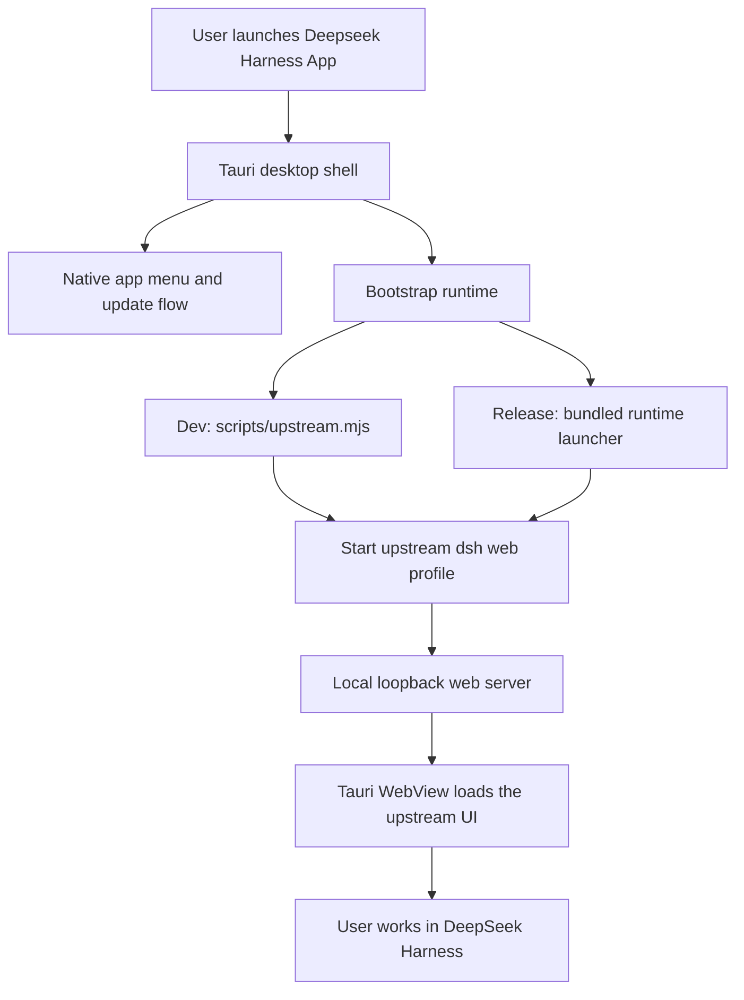

# Deepseek Harness App

Desktop host for [DeepSeek Harness](https://github.com/deepseek-ai/deepseek-harness).

This repository packages the upstream harness as a native Tauri app. It does
not fork the agent logic or the web UI. Instead, it boots the pinned upstream
`deepseek-harness` source from `submodules/deepseek-harness` and renders the
local web profile inside a desktop WebView.

## What this repo owns

- Desktop packaging and native shell behavior
- Runtime bootstrap for dev and release builds
- Update flow, signing, and release docs
- Repository-level documentation and build scripts

## Upstream relationship

- Upstream source of truth: [deepseek-harness](https://github.com/deepseek-ai/deepseek-harness)
- Pinned checkout in this repo: `submodules/deepseek-harness`
- The upstream submodule provides the agent, web app, plugins, and runtime
  behavior
- This repo should stay thin and avoid duplicating upstream product logic

## Architecture



See [docs/ARCHITECTURE.md](docs/ARCHITECTURE.md) for the full boundary and
release model.

## Repository layout

- `apps/desktop`: Tauri desktop host
- `submodules/deepseek-harness`: pinned upstream harness source
- `scripts/upstream.mjs`: upstream build/dev bridge
- `docs/`: architecture, design, platform, release, and checklist notes

## Quick start

```bash
git submodule update --init --recursive
pnpm install
pnpm dev
```

## Common commands

```bash
pnpm upstream:dev
pnpm upstream:build
pnpm build
```

## Development notes

- The app starts the upstream web profile locally and redirects the desktop
  window to the emitted loopback URL.
- Native app actions live in the Tauri shell, while the upstream harness keeps
  ownership of the agent experience.
- Release builds are expected to bundle the runtime closure so end users do not
  need to clone the repo or install upstream dependencies.

## Docs

- [Architecture](docs/ARCHITECTURE.md)
- [Design](docs/DESIGN.md)
- [Platforms](docs/PLATFORMS.md)
- [Release](docs/RELEASE.md)
- [Checklist](docs/CHECKLIST.md)
- [Contributing](CONTRIBUTING.md)

## License

MIT. See [LICENSE](LICENSE).
