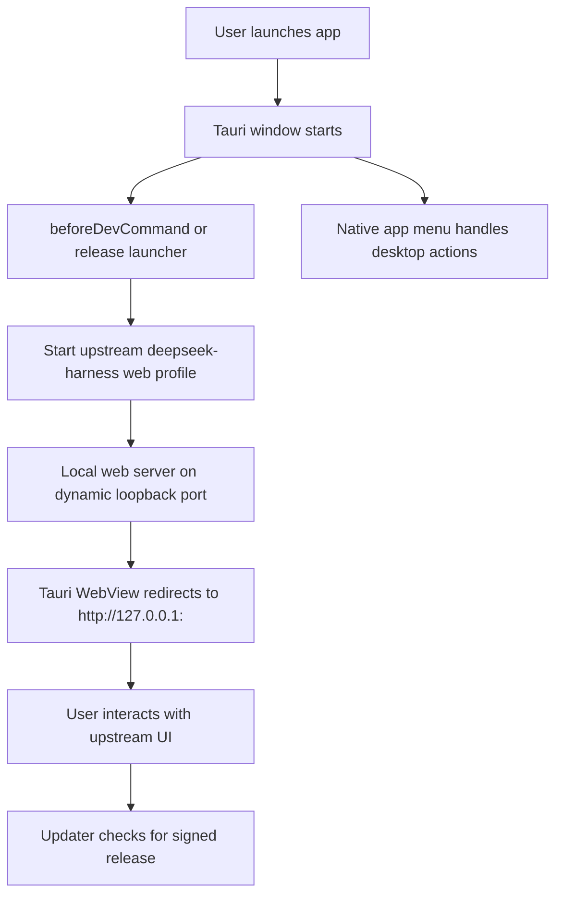

# Architecture

`Deepseek Harness` is a thin desktop host around the upstream harness.
The goal is to ship a single installable desktop app without copying the agent
or chat logic into a second codebase.

## Runtime flow

## Repo boundaries

- This repo owns desktop packaging, update delivery, signing, and release docs.
- The upstream submodule owns agent behavior, web UI, and profile boot logic.
- The desktop app should not duplicate upstream session, model, tool, or plugin
  logic.
- The desktop app should not inject a custom WebView titlebar over upstream UI;
  window chrome and app menus stay native.

## Distribution model

- The repository includes the pinned upstream source as a submodule for
  reproducible development and release builds.
- Release builds must not require end users to initialize submodules or install
  upstream npm dependencies.
- Desktop builds run the upstream production build first, then package the
  runtime dependency closure needed to launch the web profile locally.
- The release host boots a tiny launcher script from `src-tauri/runtime`, which
  resolves the packaged runtime root, starts `dsh --profile web --port 0`, and
  redirects the window to the emitted loopback URL.
- Tauri then packages the native desktop host, upstream runtime assets, and
  updater artifacts.

## Dependency model

- Developers need the submodule and its dependencies because they build from
  source.
- End users install platform artifacts only. They should not download the
  submodule, run `pnpm install`, or manage a Node workspace.
- Any runtime requirement from upstream must be bundled as an app resource or
  sidecar before release.

## Update model

- The app checks signed update metadata on startup.
- Release artifacts are signed before publication.
- The updater verifies the signature before installing.
